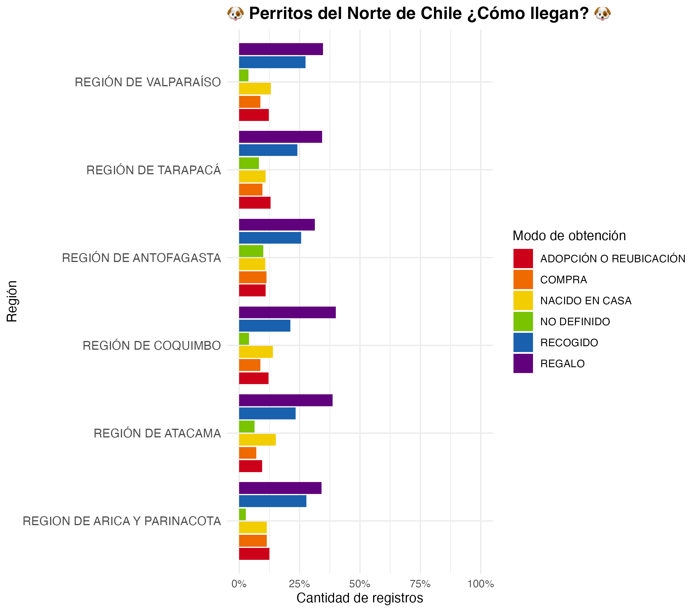

# Perritos del Norte

*Noviembre 13, 2025*

En el norte de Chile, los perritos son parte del alma de cada ciudad. Desde las playas de Arica hasta las calles soleadas de Antofagasta, es común verlos acompañando a la gente, durmiendo bajo una sombra o moviendo la cola en las ferias.

Sin embargo, las condiciones extremas de nuestro característico norte, como el sol implacable, el desierto infinito y las largas distancias hacen que la vida para muchos de ellos no sea fácil, pero también revelan el enorme cariño y compromiso de las comunidades locales para con sus cuidados.

Pero el mejor amigo de las personas no siempre ha sido el que más ayuda necesita. Por mucho tiempo han sido elegidos aquellos que vienen desde negocios de explotación y compra venta, lo cual ha llevado al aumento de la población de manera significativa y, lamentablemente, el maltrato animal.

Esto a lo largo de los años ha cambiado, **o eso es lo que espero yo**. En el último tiempo, se han dado a conocer las condiciones de muchos criaderos y se ha destacado la importancia y lo bonito que significa acoger a un animal que lo necesita, y que ha vivido en condiciones deplorables.

Es por ello que, en base a mi conocimiento del tema (*muy poco*), quise saber qué tan real es esta tendencia que muestra mis redes sociales: **¿es la adopción uno de los métodos de obtención más común en la actualidad? ¿me encuentro en mi burbuja de buenas personas o es la realidad del país?**

De esta forma he escogido el norte para hacer este diagnóstico, debido a que a lo largo de los años los perros callejeros han sido un tema en discusión.

### **En primer lugar,** es importante cargar todas los paquetes que utilizaremos a lo largo del trabajo.

```{r}
install.packages("tidyverse")

install.packages("readxl")

install.packages("dplyr")
```

Ahora haremos llamado a sus librerias correspondientes

```{r}
library(tidyverse)
library(readxl)
library(dplyr)
library(ggplot2)
```

Una vez cargadas las libererias, llamaremos a nuestra base de datos, que fue descargada del Informe final: Estimación de la población canina y felina del país y diagnóstico de la tenencia responsable, de SUBDERE.

Accede al estudio "[Estimación de la población caninca y felina del país y diagnístico de la tenencia responsable](https://proactiva.subdere.gov.cl/handle/123456789/644)". En esta página encontrarás también la [base de datos con su actualización al 30 de septiembre de 2025](https://proactiva.subdere.gov.cl/bitstream/handle/123456789/644/RNMAC%20al%2030-09-2025%20%281%29.xlsx?sequence=43&isAllowed=y).

```{r}
datos <- read_xlsx("data/RNMAC al 30-09-2025 (1).xlsx")
```

Ahora veamos como es la base de datos `View(datos)` y podemos aprovechar de ver que variables tiene `colnames(datos)` . Además, a la base de datos le aplicaremos `janitor::clean_names()` para eliminar los espacios y caracteres especiales, y así trabajar más fácilmente.

Es importante tener en consideración que al ser una base tan pesada en Excel, **debemos darle la indicación a R y Github que esta no será incluida en el repositorio** - esta fue una de las cosas más complejas, ya que no sabía que era posible. Para lograr esto, se debe utilizar el siguiente código desde la consola.

```{r}
usethis::use_git_ignore("data/RNMAC al 30-09-2025 (1).xlsx")
```

Ahora limpiaremos la base con las categorías que nos interesan, ya que hay muchas y nosotros en verdad sólo queremos saber **qué tanto adoptan** jajaja, por lo que nos enfocaremos en Región y el Modo de obtención.

```{r}
datos_filtrados <- datos|> 
  group_by(region, modo_de_obtencion) |> 
  summarise(n = n()) |> 
  group_by(region) |> 
  mutate(porcentaje = n / sum(n) * 100)
```

Ahora si queremos ver si funciono lo hacemos con `View(datos_filtrados)`

Finalmente crearemos nuestro gráfico para realizar la comparativa de todos los modos de obtención. Buscaremos que sea colorido para poder **diferenciar mejor los tipos de obtención**, y usaremos el porcentaje para comparar de manera más sencilla **cuál es el modo de obtención más común en cada región**.

```{r}
colores_perritos <- c("#cd001a","#ef6a00","#f2cd00","#79c300","#1961ae","#61007d")

perrito <- emo::ji("dog")

ggplot(datos_filtrados,
       aes(
         x = reorder(region, porcentaje),
         y = porcentaje,
         fill = modo_de_obtencion
       )) +
  geom_col(position = "dodge2") +
  scale_y_continuous(labels = scales::percent_format(scale = 1),
                     limits = c(0, 100)) +
  scale_fill_manual(values = colores_perritos) +
  coord_flip() +
  labs(
    title = paste(
      emo::ji("dog"),
      "Perritos del Norte de Chile ¿Cómo llegan?",
      emo::ji("dog")
    ),
    x = "Región",
    y = "Cantidad de registros",
    fill = "Modo de obtención"
  )+
  theme_minimal() +
  theme(plot.title = element_text(size = 14, face = "bold"),
        axis.text.y = element_text(size = 10))
```

Contemplemos el gráfico...



Es así, como podemos mirar un maravilloso gráfico lleno de color, que nos afirma que **los perritos regalados suelen ser el modo de obtención más común en la zona norte**, lo cual es bastante curioso porque no nos aclara si este fue comprado o rescatado. Lo que si de alguna u otra manera podemos decir que en la mayoría de las regiones del norte la adopción está por sobre la compra de perro, lo cual es muy positivo y esperanzador. Esperemos que siga creciendo y así mantener mi burbuja de buenas personas.

### **¡Digamos NO a la compra y venta de animales!**
